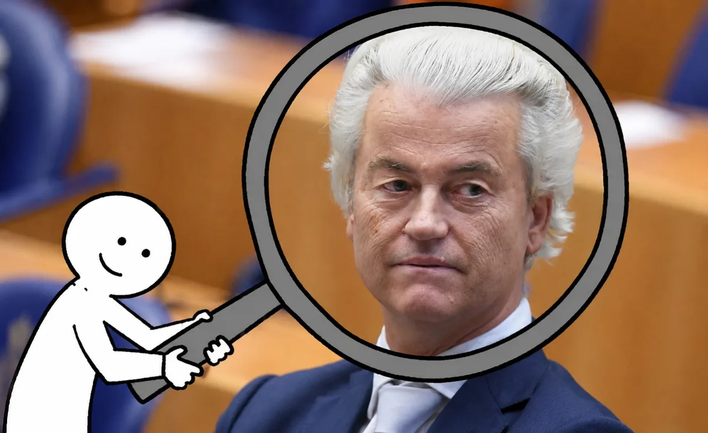

# wilders-search

Archive + AI-search pipeline for **all public statements of a politician**,
configured per person (`config/<slug>.json`). First target: Geert Wilders —
live at **https://wilders.scrib-r.com**. Same architecture and
transcript/index format as [abo-ali-search](https://github.com/sayfjawad/abo-ali-search).



Ask a question in plain language and get the matching fragments across three
decades of parliamentary records and videos — each with date, timestamp,
speaker, source link and a play button that jumps to the exact moment. An
optional local LLM writes a summary with verifiable citations (RAG). No cloud
APIs anywhere: embeddings, ASR and the LLM all run on own GPUs.

## Sources

1. **Tweede Kamer verslagen** (official, corrected transcripts, 2013–now) via
   the open OData API (`gegevensmagazijn.tweedekamer.nl`, no key). vlos 2.0
   XML is parsed into per-vergadering transcripts; only vergaderingen where
   the person speaks are kept. Segments carry a `wallclock` timestamp
   (markeertijdbegin) used to link into debate video.
2. **Handelingen 1995–2013** from `officielebekendmakingen.nl` (SRU API), so
   coverage starts at the person's first year in parliament.
3. **YouTube channels** (e.g. the party channel) — audio-only opus via
   yt-dlp, transcribed with whisperx (ASR, optionally sharded over several
   GPU hosts with `remote_worker.sh`).
4. **Debat Direct video** (plenary sessions, ~2010–now). The agenda API gives
   per-day debates with start/end wallclocks; the debate's HLS `vodUrl` only
   yields real footage when windowed with `?start=&end=` (otherwise you get a
   "nomeeting" stub). Lowest variant (320×180 + separate audio rendition) is
   stream-copied with ffmpeg — ~130 MB per debate hour, no re-encode.

## Pipeline

```bash
python3 tk_sync.py            # incremental OData sync -> <data>/tk/xml/
python3 tk_parse.py           # vlos XML -> <data>/transcripts/tk_*.json
python3 ob_sync.py            # 1995-2013 Handelingen XML (SRU)
python3 ob_parse.py           #   -> <data>/transcripts/ob_*.json
python3 yt_sync.py            # yt-dlp audio+info-json -> <data>/youtube/
python3 transcribe_batch.py   # whisperx (--shard i/n, --diarize) -> yt_*.json
python3 dg_sync.py            # Debat Direct video -> <data>/debatgemist/
python3 build_index.py        # BGE-M3 embeddings -> <data>/index/
./run.sh                      # FastAPI app (default port 8902)
```

All scripts take an optional person slug argument (default `wilders`). Every
step is incremental/idempotent: OData `GewijzigdOp` cursor, yt-dlp download
archive, file-exists + state.json checks — rerunning is always safe, and
rerunning `tk_parse.py` upgrades transcripts as corrected verslagen appear.

## Distributed video download

The Debat Direct CDN paces individual HLS streams, so the archive is fetched
with N parallel shards spread over multiple hosts (see `hosts.env.example`):

- `dg_distributed.sh` — idempotent orchestrator: starts missing local shards,
  pushes `dg_sync.py` + a dates manifest to remote hosts (only ffmpeg +
  python3 + ssh needed there) and starts them detached, plus the puller.
- `dg_pull.sh` — drains finished files from the remotes (rsync
  `--remove-source-files`, partial downloads excluded) and merges the
  per-shard state files into `state.json`, which the app uses to map a
  transcript `wallclock` to a local video file + offset.
- `dg_sync.py --shard i/n --dates-json … --have …` — a shard worker; `--have`
  prevents re-downloading files that already live on the main host.

## Self-healing operation & reporting

- `resume.sh` (cron `@reboot`) restarts every sync, the distributed download,
  the app service and the milestone watchers after a crash or power loss;
  everything resumes from its own state.
- `milestone_watch.sh {text|youtube|video|transcribe}` — detached watchers
  that rebuild the index, restart the app and send milestone e-mails
  (`notify.py`) when a phase completes.
- `status.py` (cron, 15 min) appends a machine-readable snapshot to
  `progress.log`; `progress_report.py` (cron: hourly file, daily mail) turns
  that history into a human progress report with download rate and a
  completion prognosis.

## Search app

`app.py` + `static/index.html`: FastAPI, semantic search (GPU), date and
"only statements by <person>" filters, `/api/ask` RAG endpoint (auto-detects
a local llama.cpp server), NL/EN interface, audio/video playback at the
matched timestamp. Sources are tagged official record vs ASR so quotes can
always be verified against the original.

## Transcript format (abo-ali compatible)

- `<base>.json`: `{"title", "duration_seconds", "segments": [{speaker_id,
  speaker, start, end, text}]}` — TK segments additionally have `wallclock`.
- `<base>.metadata.json`: `{"id", "title", "url", "upload_date",
  "duration_seconds", "source": "tk_verslag" | "ob_handeling" |
  "youtube:<channel>", "transcript_source": "official" | "asr"}`.

## Deployment

- App as a systemd **user** service (linger enabled) so it survives reboots:
  `systemctl --user {status,restart} wilders-search`.
- A small edge VPS runs nginx with TLS (certbot) and proxies the public
  domain to the GPU host over a private Tailscale network, with streaming-
  friendly proxy settings for the media endpoints.

## Gotchas worth knowing

- OData: `$top` caps the *total* result count and suppresses
  `@odata.nextLink` — omit it and follow server paging.
- vlos XML: speaker-label alineaitems ("De **heer X**:") must be stripped;
  nested interruption text must not be double-counted; `spreker@objectid` is
  *not* the OData Persoon Id — match by name.
- Debat Direct: without the `?start=&end=` window the vodUrl returns a stub
  playlist; yt-dlp's `-f worst` picks a keyframes-only track — use ffmpeg
  with the explicit variant instead.
- ffmpeg ≥ 7/8 refuses the CDN's `.m4v` HLS segments unless
  `-allowed_extensions ALL -extension_picky 0` is set (auto-detected in
  `dg_sync.py`).
- YouTube bulk downloads without `-t sleep` get rate-limited within minutes.

## TODO

- Diarization for YouTube ASR (`transcribe_batch.py --diarize`, needs
  `HF_TOKEN`).
- Optional extra sources: interviews on broadcaster channels, X/Twitter video.
